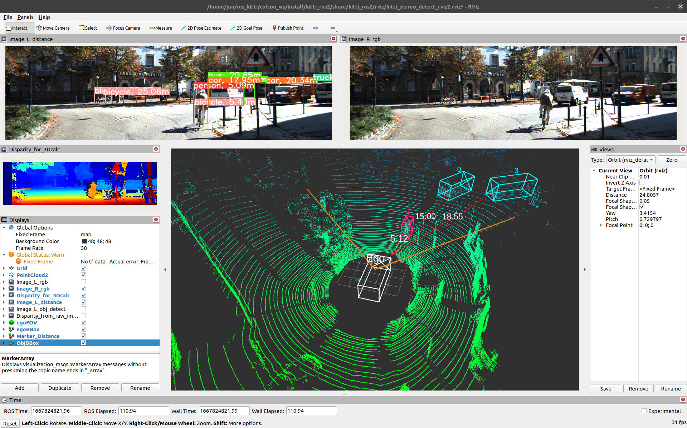
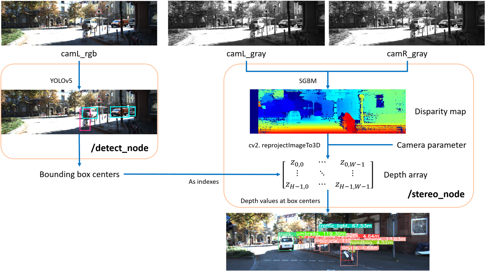
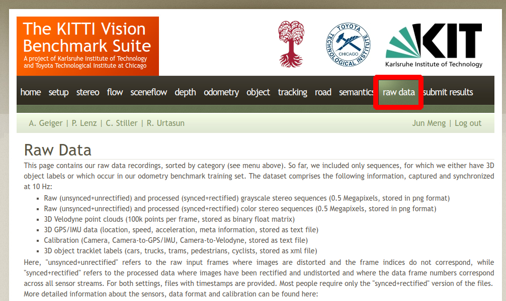
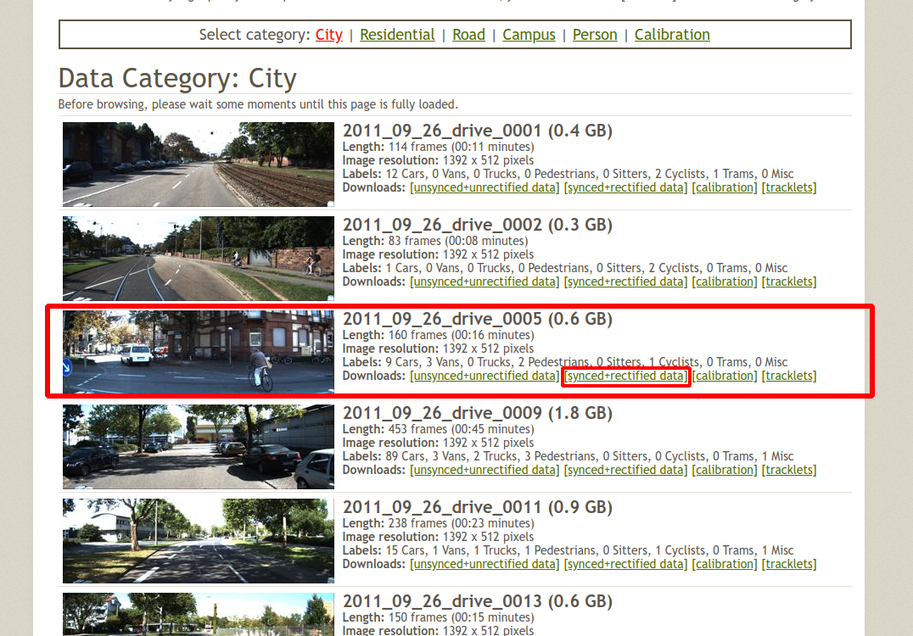
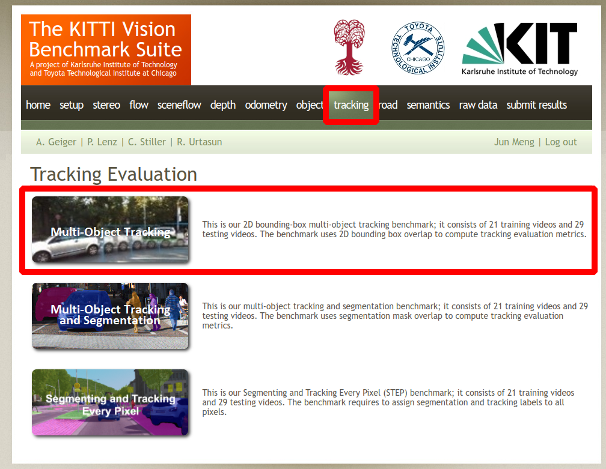
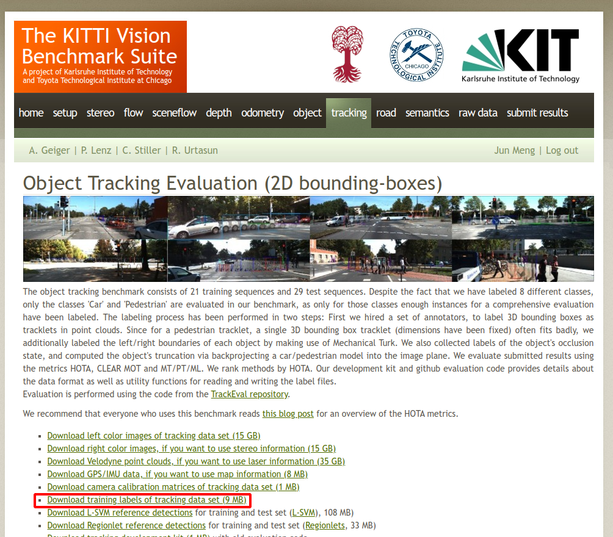

# ROS2 + KITTI
## Objet detection & Stereo depth estimation


- Visualize raw images and point cloud in ROS2
- Implement **object detection** algorithm YOLOv5
- Implement **stereo depth estimation** algorithm SGBM  
<div align="center">
  <br>  
  Visualization  
</div> 

<br>

<div align="center">
  <br>  
  Software pipeline  
</div>

***
## Prerequisitions
### 1) Install ROS2-galactic
- For ROS2 install follow the [official documentation](https://docs.ros.org/en/humble/Installation/Ubuntu-Install-Debians.html)  
  >**What if I have to install ROS2 with ROS1 already in my PC?**  
  $\to$ Settings for [ROS2 coexistence with ROS1](https://stackoverflow.com/questions/61333625/ros2-coexistence-with-ros#:~:text=Based%20on%20Shrijit%20Singh%20comment%2C). 

<br>

***
# Build and Run
### Clone the repository to local
```bash
git clone https://github.com/junmeng6025/ros2_kitti.git
```
### Install libiaries for YOLOv5
```bash
cd ros2_kitti
pip install -r requirements.txt
```

- If you run into errors that claims missing some python libraries, please check `requirements.txt` in `/colcon_ws/src/kitti_ros2/yolov5`.  
- Or you can use `rosdep` to install dependencies automatically. (See below `Possible issues`)  
- Or install the missing libraries according to the error messages ...
### Download KITTI dataset and extract
TO download dataset you need to register and login first  
- `rawdata` [download](https://s3.eu-central-1.amazonaws.com/avg-kitti/raw_data/2011_09_26_drive_0005/2011_09_26_drive_0005_sync.zip)  
  <p float="left">
    
     
  </p>
  
- `tracking data` [download](https://s3.eu-central-1.amazonaws.com/avg-kitti/data_tracking_label_2.zip)  
  <p float="left">
    
     
  </p>
  
The data files should be organized as:
```bash
ros2_kitti
├── colcon_ws
│   └──...
│
├── rawdata #------------------------------ create this folder yourself
│   ├── 2011_09_26
│   │   ├── 2011_09_26_drive_0005_sync
│   │   │   ├── image_00
│   │   │   ├── image_01
│   │   │   ├── image_02
│   │   │   ├── image_03
│   │   │   ├── oxts
│   │   │   └── velodyne_points
│   │   ├── calib_cam_to_cam.txt
│   │   ├── calib_imu_to_velo.txt
│   │   └── calib_velo_to_cam.txt
│   │
│   ├── 2011_09_26_calib.zip #------------ download from KITTI website
│   └── 2011_09_26_drive_0005_sync.zip #-- download from KITTI website
│
├── data_tracking_label_2
│   └── training
│       └── label_02     # tracking data ID not relevant to rawdata ID
│           ├── 0000.txt # e.g. '0000.txt' here matches with rawdata '2011_09_26_drive_0005'
│           └── ...      # you have to MATCH them by YOURSELF
│
└── README.md
```
### Build the workspace
- use colcon build command to generate executable files automatically
  ```bash
  cd ros2_kitti/colcon_ws
  ```
  ! ALWAYS make sure you've sourced ROS2 to your current terminal before "colcon build"
  ```bash
  source /opt/ros/galactic/setup.bash
  colcon build
  ```
  > use the command `echo ${ROS_DISTRO}` to check the current ROS distro in your working Terminal  
  > make sure it returns `galactic` or other ROS2 distro
- after build, copy the folder `/data` in
    ```bash
    /src/kitti_ros2/yolov5
    ```
    to
    ```bash
    /install/kitti_ros2/lib/python3.8/site-packages/yolov5
    ```
### Launch the nodes
source the `setup.sh` to current terminal
```bash
# stay in the directory /ros2_kitti/colcon_ws
source install/setup.sh
```
```bash
ros2 launch kitti_ros2 kitti_stereo_detect.launch.py 
```

There are two other options:
- **B:**  Visualize KITTI data in Rviz **without** detection or depth estimation
  ```bash
  ros2 launch kitti_ros2 kitti_visualization.launch.py
  ```
- **C:**  Implement the detection but **without** depth estimation
  ```bash
  ros2 launch kitti_ros2 kitti_detect.launch.py 
  ```

***
# Possible issues:
### 1) Coexist ROS1 and ROS2
Settings for [ROS2 coexistence with ROS1](https://stackoverflow.com/questions/61333625/ros2-coexistence-with-ros#:~:text=Based%20on%20Shrijit%20Singh%20comment%2C).  
### 2) Use `rosdep` or `rosdepc` ('c' for Chinese)
`rosdepc` is a tool that can help to install all the dependencies for a workspace automatically.  
#### install and initialize rosdepc
```bash
sudo pip3 install rosdepc
sudo rosdepc init & rosdepc update
```
#### install dependencies for workspace
```bash
# cd to the workspace root path
rosdepc install -i --from-path src --rosdistro galactic -y
```
