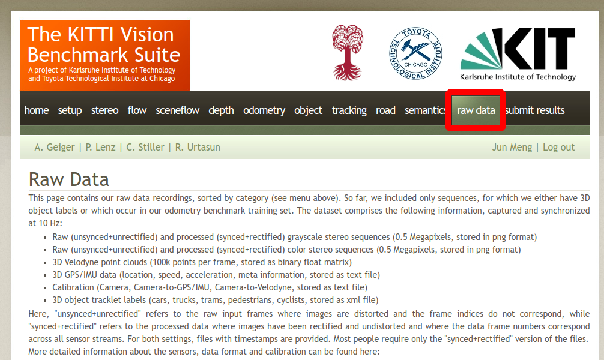
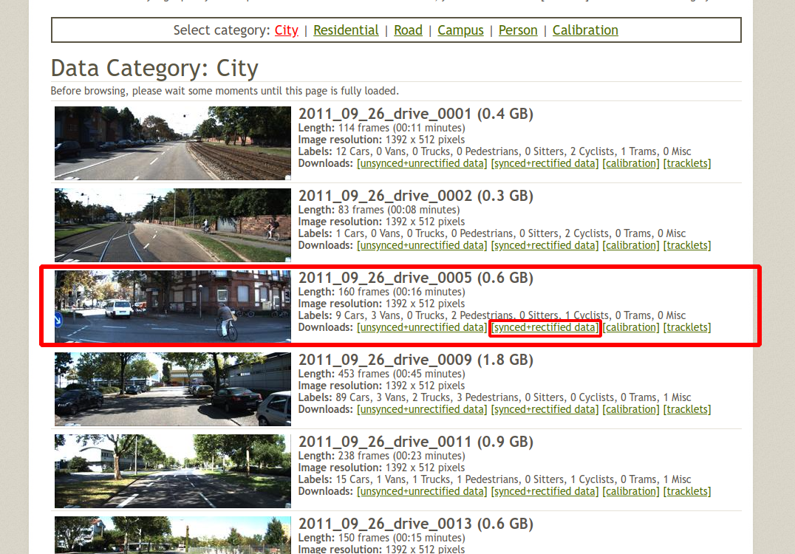
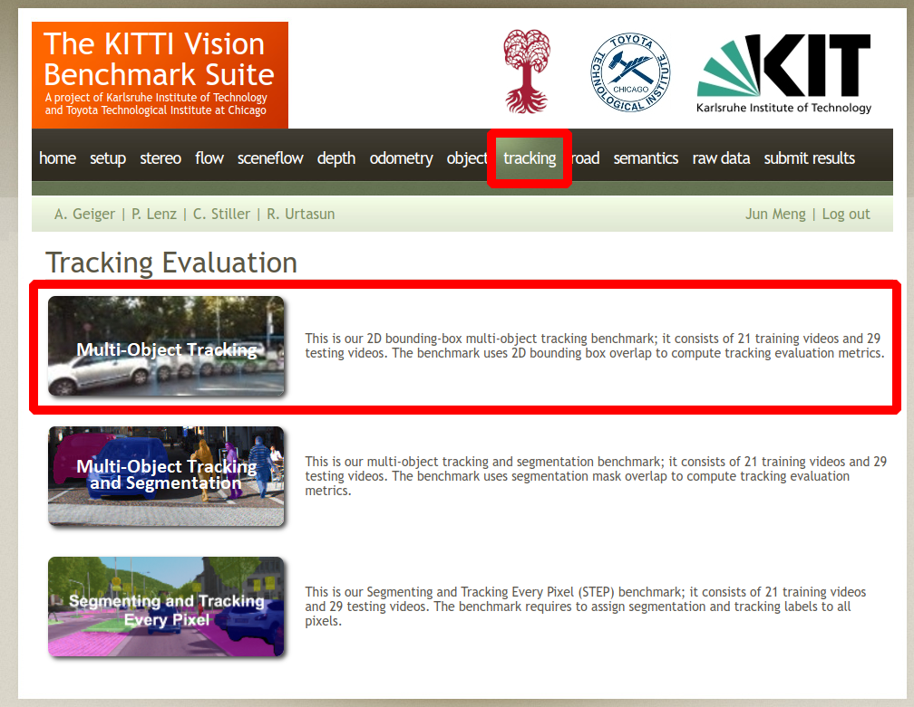
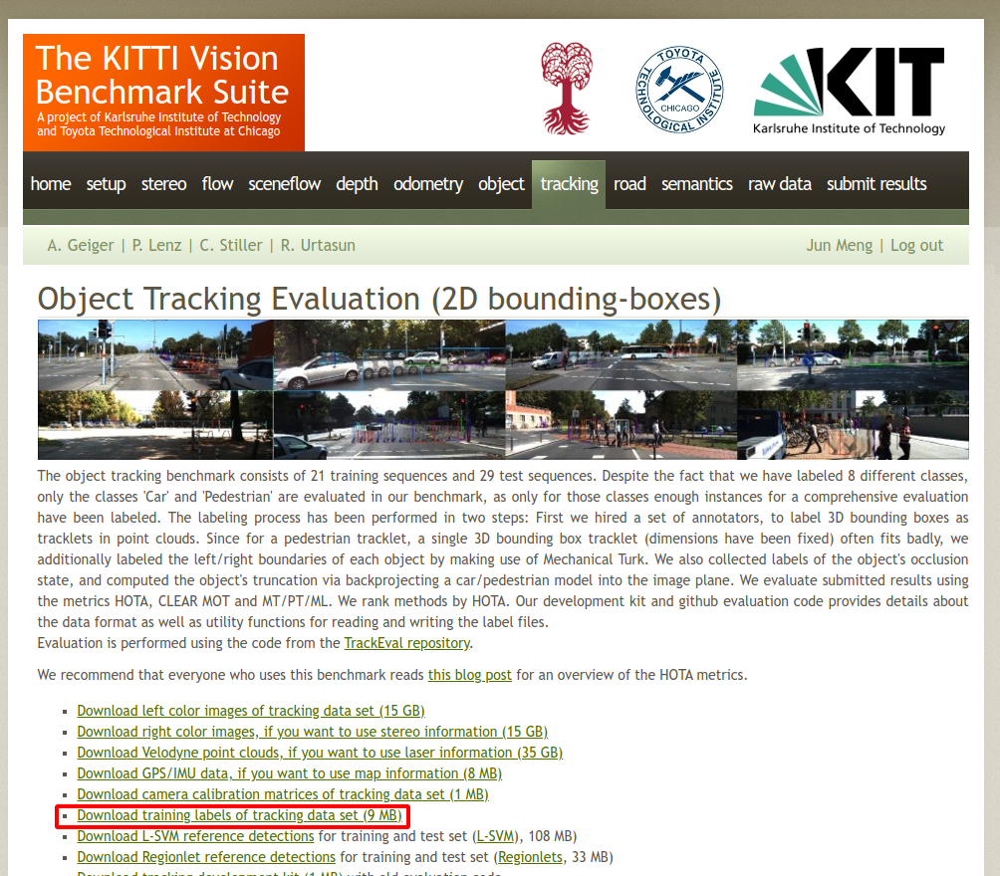

# KITTI Data preparation
TO download dataset you need to register and login first  
- `rawdata` [download](https://s3.eu-central-1.amazonaws.com/avg-kitti/raw_data/2011_09_26_drive_0005/2011_09_26_drive_0005_sync.zip)  
  <p float="left">
    
     
  </p>
  
- `tracking data` [download](https://s3.eu-central-1.amazonaws.com/avg-kitti/data_tracking_label_2.zip)  
  <p float="left">
    
     
  </p>
  
The data files should be organized as:
```bash
ros2_kitti
├── colcon_ws
│   └──...
│
├── rawdata #------------------------------ create this folder yourself
│   ├── 2011_09_26
│   │   ├── 2011_09_26_drive_0005_sync
│   │   │   ├── image_00
│   │   │   ├── image_01
│   │   │   ├── image_02
│   │   │   ├── image_03
│   │   │   ├── oxts
│   │   │   └── velodyne_points
│   │   ├── calib_cam_to_cam.txt
│   │   ├── calib_imu_to_velo.txt
│   │   └── calib_velo_to_cam.txt
│   │
│   ├── 2011_09_26_calib.zip #------------ download from KITTI website
│   └── 2011_09_26_drive_0005_sync.zip #-- download from KITTI website
│
├── data_tracking_label_2
│   └── training
│       └── label_02     # tracking data ID not relevant to rawdata ID
│           ├── 0000.txt # e.g. '0000.txt' here matches with rawdata '2011_09_26_drive_0005'
│           └── ...      # you have to MATCH them by YOURSELF
│
└── README.md
```